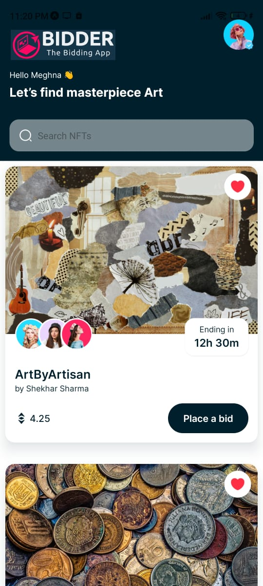
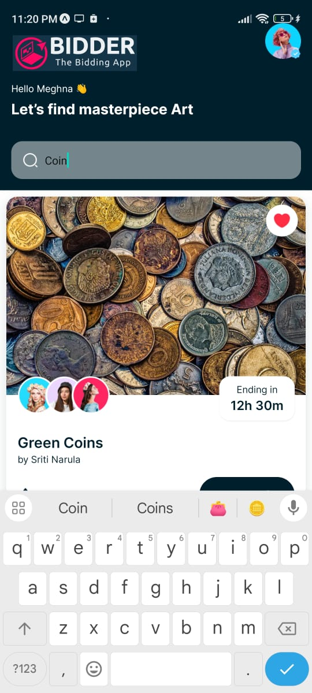

# BIDDER - The Bidding App (react-native based)

A bidding app where you can bid for products or services , and also can put your product/service for bid.

## Installation

To run this project:   
1-DOWNLOAD ZIP FOLDER  
2-EXTRACT ALL THE FILE  
3-INSTALL NODEJS ON YOUR SYSTEM  
4-RUN FOLLOWING COMMANDS IN YOU TERMINAL  
```
npm install
```
```
npm audit fix
```
```
npm audit fix --force
```
```
npm start
```  
5-YOU WILL GET A QR CODE  
6-INSTALL "EXPO GO" ON YOUR MOBILE DEVICE  
7-SCAN THE QR CODE  
AND YOU MUST BE ABLE TO SEE THE APP WORKING
## Screenshots
<div style="display: flex; justify-content: space-between;">
    
    
    
</div>


